# sankey_diagram_flutter

A highly customizable Sankey diagram widget for Flutter. Visualize flow-based data — broker distribution, fund flows, supply chains, survey results, and more — with smooth Bézier curves, animated entries, hover effects, and full interactivity.

## Features

- **Smooth Bézier links** rendered with a `CustomPainter` — no web view, no canvas bridging
- **Animated entry** with a configurable duration and easing curve
- **Interactive** — tap nodes or links to select, hover to highlight related flows
- **Tooltip** shown on tap, with a built-in default style or a fully custom builder
- **Automatic layout** driven by node type (`buyer` → left, `neutral` → middle, `seller` → right), or fully topology-driven via BFS longest-path (`autoLayout: true`)
- **Circular link support** — backward flows rendered as upward arcs, with automatic detection
- **Node sorting** by value, by label, or in insertion order
- **Legend** with four position options (top / bottom / left / right) or hidden; supports tap-to-highlight
- **Programmatic control** via `SankeyController` — highlight nodes from external UI
- **Value formatter** that auto-scales to K / M / B / T
- **Dark-mode aware** — label and tooltip colours adapt to `ThemeData.brightness`
- **Pure Dart/Flutter** — no platform channels, no native dependencies

## Screenshots

<table>
  <tr>
    <th align="left">Example</th>
    <th align="center">Dark mode</th>
    <th align="center">Light mode</th>
  </tr>
  <tr>
    <td><b>Broker Distribution</b><br/>2 columns</td>
    <td>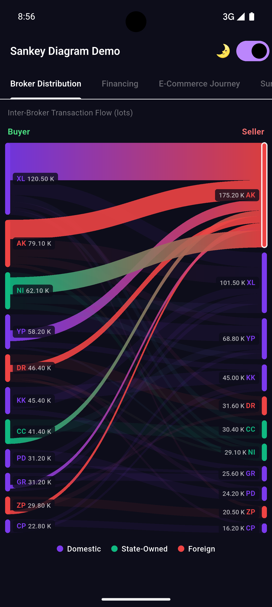</td>
    <td>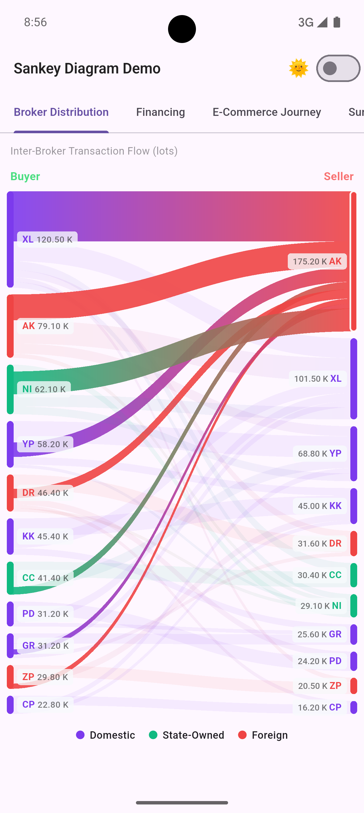</td>
  </tr>
  <tr>
    <td><b>Financing</b><br/>2 columns</td>
    <td>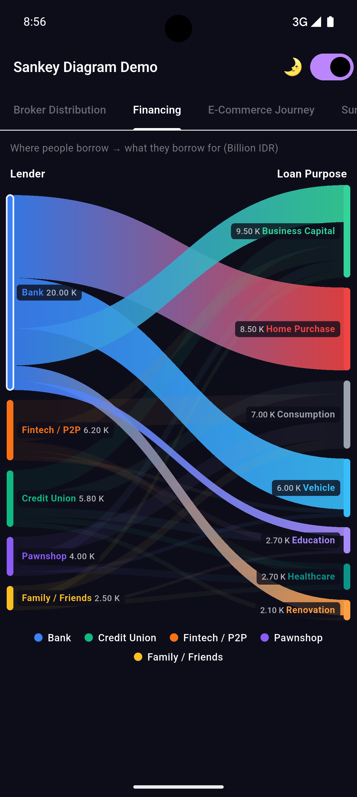</td>
    <td>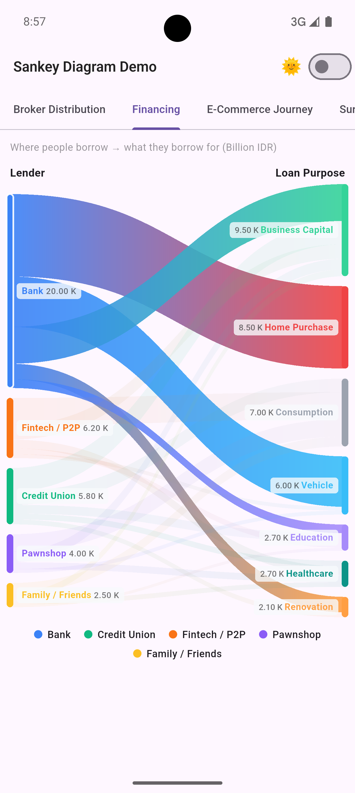</td>
  </tr>
  <tr>
    <td><b>E-Commerce Journey</b><br/>4 columns</td>
    <td>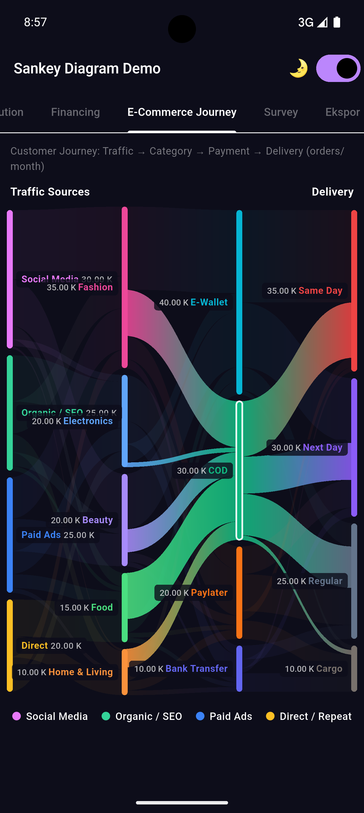</td>
    <td>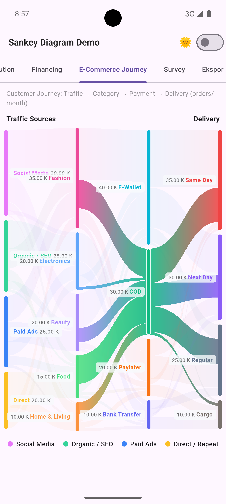</td>
  </tr>
  <tr>
    <td><b>Survey</b><br/>2 columns</td>
    <td>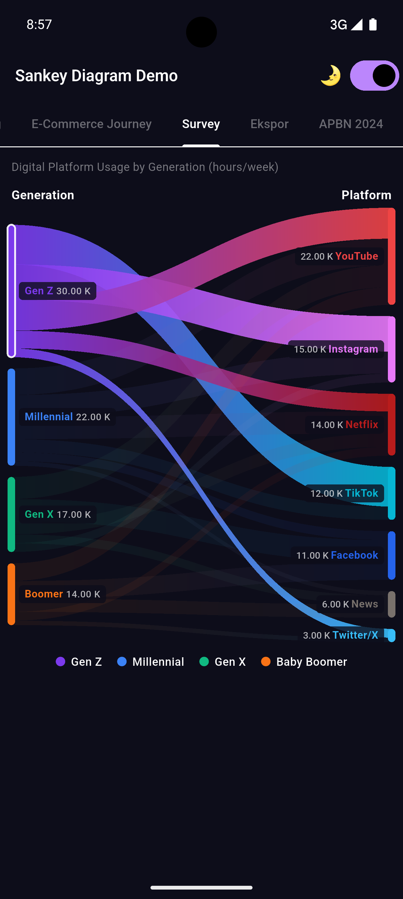</td>
    <td>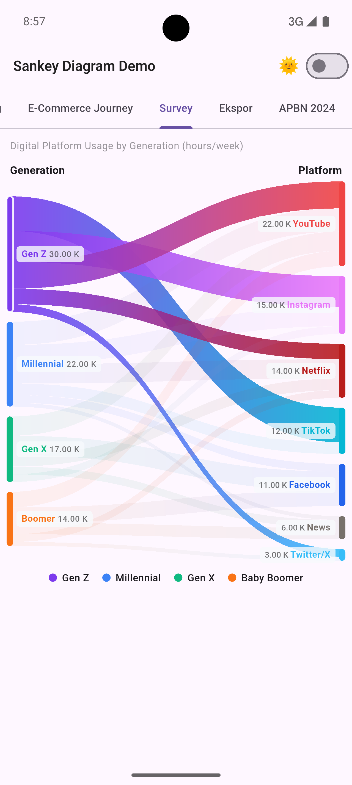</td>
  </tr>
  <tr>
    <td><b>Export / Import</b><br/>2 columns</td>
    <td>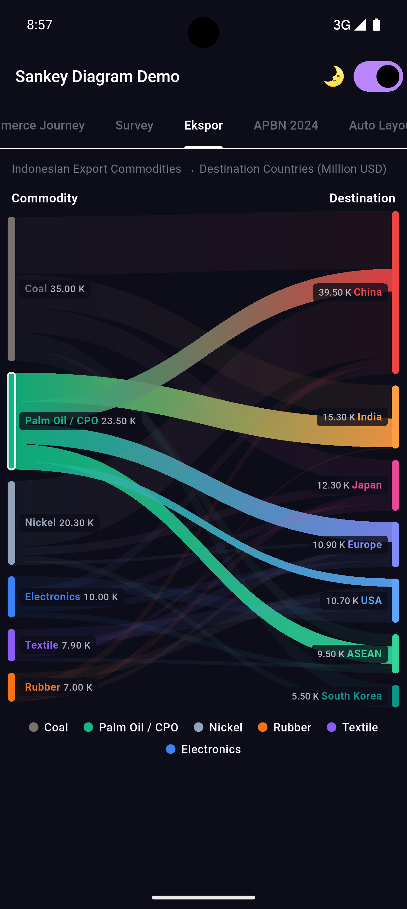</td>
    <td>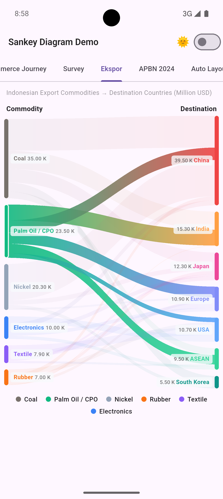</td>
  </tr>
  <tr>
    <td><b>APBN 2024</b><br/>3 columns</td>
    <td>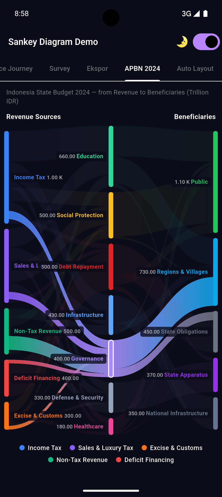</td>
    <td>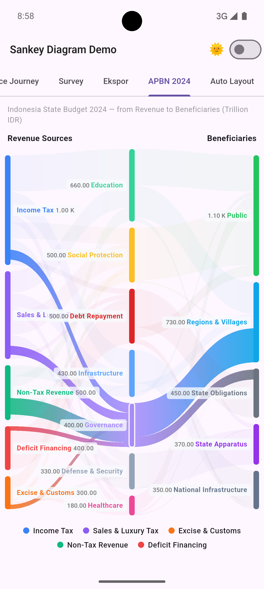</td>
  </tr>
  <tr>
    <td><b>Auto Layout</b><br/>topology-driven + circular link</td>
    <td>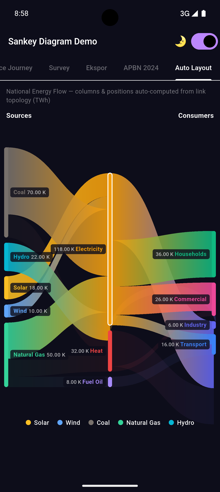</td>
    <td>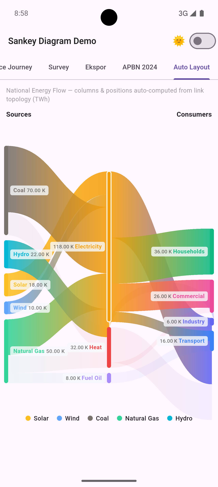</td>
  </tr>
</table>

## Installation

```yaml
dependencies:
  sankey_diagram_flutter: ^1.1.0
```

Then run:

```bash
flutter pub get
```

## Quick start

```dart
import 'package:sankey_diagram_flutter/sankey_diagram_flutter.dart';

SankeyDiagram(
  data: SankeyData(
    nodes: const [
      SankeyNode(id: 'a', label: 'Source A', color: Color(0xFF7C3AED), type: SankeyNodeType.buyer),
      SankeyNode(id: 'b', label: 'Source B', color: Color(0xFF3B82F6), type: SankeyNodeType.buyer),
      SankeyNode(id: 'x', label: 'Target X', color: Color(0xFF10B981), type: SankeyNodeType.seller),
      SankeyNode(id: 'y', label: 'Target Y', color: Color(0xFFEF4444), type: SankeyNodeType.seller),
    ],
    links: const [
      SankeyLink(sourceId: 'a', targetId: 'x', value: 300),
      SankeyLink(sourceId: 'a', targetId: 'y', value: 150),
      SankeyLink(sourceId: 'b', targetId: 'x', value: 200),
      SankeyLink(sourceId: 'b', targetId: 'y', value: 350),
    ],
  ),
  height: 360,
)
```

## Data model

### SankeyNode

Represents a single node (bar) in the diagram.

| Property | Type | Required | Description |
|---|---|---|---|
| `id` | `String` | yes | Unique identifier referenced by links |
| `label` | `String` | yes | Display text rendered on the node |
| `color` | `Color` | yes | Fill colour of the node bar and its outgoing links |
| `type` | `SankeyNodeType` | no | `buyer` (left), `seller` (right), `neutral` (middle). Default: `neutral` |
| `column` | `int?` | no | Explicit zero-based column index. Overrides `type`. Enables 4+ column layouts. |
| `subLabel` | `String?` | no | Secondary text shown below the label |
| `metadata` | `Map<String, dynamic>?` | no | Arbitrary data passed through to tap/hover callbacks |

```dart
const SankeyNode(
  id: 'bank',
  label: 'Bank',
  color: Color(0xFF3B82F6),
  type: SankeyNodeType.buyer,
  subLabel: 'Commercial',
)
```

### SankeyLink

Represents a directed flow between two nodes.

| Property | Type | Required | Description |
|---|---|---|---|
| `sourceId` | `String` | yes | `id` of the source node |
| `targetId` | `String` | yes | `id` of the target node |
| `value` | `double` | yes | Flow magnitude — determines link thickness |
| `color` | `Color?` | no | Override link colour (defaults to source node colour) |
| `label` | `String?` | no | Optional label attached to this link |

### SankeyData

Container holding all nodes and links. Provides helpers for querying the graph.

```dart
final data = SankeyData(nodes: [...], links: [...]);

data.nodeById('bank');           // SankeyNode?
data.outgoingLinks('bank');      // List<SankeyLink>
data.incomingLinks('mortgage');  // List<SankeyLink>
```

## Column layout

### Automatic layout (2–3 columns)

Column assignment via `SankeyNodeType` — no coordinates needed.

| `SankeyNodeType` | Column |
|---|---|
| `buyer` | Left |
| `neutral` | Middle (triggers a three-column layout) |
| `seller` | Right |

```dart
// Two-column: Buyer → Seller
SankeyNode(id: 'src', label: 'Source', color: ..., type: SankeyNodeType.buyer)
SankeyNode(id: 'dst', label: 'Dest',   color: ..., type: SankeyNodeType.seller)

// Three-column: Buyer → Neutral → Seller
SankeyNode(id: 'src', label: 'Source',  color: ..., type: SankeyNodeType.buyer)
SankeyNode(id: 'mid', label: 'Middle',  color: ..., type: SankeyNodeType.neutral)
SankeyNode(id: 'dst', label: 'Dest',    color: ..., type: SankeyNodeType.seller)
```

### Explicit column placement (4+ columns)

Set `column` on each node to place them in any column. This unlocks diagrams
with four or more steps — energy flows, supply chains, multi-stage budget
allocations, and more.

```dart
// Four-column energy flow: Source → Conversion → Grid → End Use
const nodes = [
  SankeyNode(id: 'coal',    label: 'Coal',        color: Color(0xFF78716C), column: 0),
  SankeyNode(id: 'gas',     label: 'Natural Gas',  color: Color(0xFF3B82F6), column: 0),
  SankeyNode(id: 'solar',   label: 'Solar',        color: Color(0xFFFBBF24), column: 0),
  SankeyNode(id: 'plant',   label: 'Power Plant',  color: Color(0xFF8B5CF6), column: 1),
  SankeyNode(id: 'grid',    label: 'Grid',         color: Color(0xFF6B7280), column: 2),
  SankeyNode(id: 'home',    label: 'Residential',  color: Color(0xFF10B981), column: 3),
  SankeyNode(id: 'industry',label: 'Industry',     color: Color(0xFFEF4444), column: 3),
];
```

> When any node has `column` set, all nodes must use explicit `column` values.
> Mixing `column` and `type`-based assignment in the same diagram is not supported.

## Styling

Pass a `SankeyStyle` to the `style` parameter to control every visual aspect of the diagram.

```dart
SankeyDiagram(
  data: data,
  height: 400,
  style: const SankeyStyle(
    nodeWidth: 10,
    nodePadding: 14,
    nodeRadius: 6,
    linkOpacity: 0.40,
    hoverOpacity: 0.90,
    dimOpacity: 0.08,
    sortOrder: SortOrder.byValue,
    legendPosition: LegendPosition.bottom,
    animationDuration: Duration(milliseconds: 800),
  ),
)
```

### SankeyStyle reference

| Property | Type | Default | Description |
|---|---|---|---|
| `nodeWidth` | `double` | `8.0` | Width of each node bar in logical pixels |
| `nodePadding` | `double` | `12.0` | Vertical gap between nodes in the same column |
| `nodeRadius` | `double` | `4.0` | Corner radius of node bars |
| `linkOpacity` | `double` | `0.45` | Default link fill opacity |
| `hoverOpacity` | `double` | `0.85` | Link opacity when the linked node or link is focused |
| `dimOpacity` | `double` | `0.12` | Opacity of unrelated links when a node or link is focused |
| `showNodeLabels` | `bool` | `true` | Whether to draw labels on nodes |
| `showTooltip` | `bool` | `true` | Whether to show a tooltip on tap |
| `labelStyle` | `TextStyle?` | — | Style for node label text |
| `valueStyle` | `TextStyle?` | — | Style for the value text below the label |
| `labelBackgroundColor` | `Color?` | — | Pill background behind each node label |
| `labelPadding` | `EdgeInsets` | `h:6 v:3` | Padding inside the label pill |
| `labelBorderRadius` | `double` | `4.0` | Corner radius of label pills |
| `animationDuration` | `Duration` | `600 ms` | Duration of the entry animation |
| `tooltipStyle` | `TooltipStyle?` | — | Colours, padding, and border for the default tooltip |
| `sortOrder` | `SortOrder` | `byValue` | `byValue`, `byLabel`, or `none` |
| `legendPosition` | `LegendPosition` | `bottom` | `top`, `bottom`, `left`, `right`, or `hidden` |
| `backgroundColor` | `Color` | `transparent` | Canvas background colour |
| `horizontalPadding` | `double` | `0.0` | Padding added on both horizontal edges |
| `verticalPadding` | `double` | `0.0` | Padding added on both vertical edges |

### Tooltip style

```dart
SankeyDiagram(
  data: data,
  style: const SankeyStyle(
    tooltipStyle: TooltipStyle(
      backgroundColor: Color(0xFF1E293B),
      borderColor: Color(0xFF334155),
      borderWidth: 1.5,
      borderRadius: 10,
      elevation: 6,
      textStyle: TextStyle(color: Colors.white, fontSize: 13),
      padding: EdgeInsets.symmetric(horizontal: 14, vertical: 10),
    ),
  ),
)
```

## Column header labels

```dart
SankeyDiagram(
  data: data,
  buyerLabel: 'Source',
  sellerLabel: 'Destination',
  buyerLabelStyle: const TextStyle(
    color: Color(0xFF4ADE80),
    fontWeight: FontWeight.w700,
  ),
  sellerLabelStyle: const TextStyle(
    color: Color(0xFFF87171),
    fontWeight: FontWeight.w700,
  ),
)
```

## Interaction callbacks

```dart
SankeyDiagram(
  data: data,
  onNodeTap: (SankeyNode node) {
    print('Tapped: ${node.label}');
    // node.metadata holds any domain data you attached
  },
  onLinkTap: (SankeyLayoutLink link) {
    print('Flow: ${link.link.sourceId} → ${link.link.targetId}');
    print('Value: ${link.link.value}');
  },
  onNodeHover: (SankeyNode? node) {
    // node is null when the cursor leaves all nodes
    setState(() => _hovered = node?.label);
  },
)
```

## Programmatic control — SankeyController

Use `SankeyController` to highlight a node from outside the diagram, for example from a list or a chip group.

```dart
class _MyPageState extends State<MyPage> {
  final _controller = SankeyController();

  @override
  void dispose() {
    _controller.dispose();
    super.dispose();
  }

  @override
  Widget build(BuildContext context) {
    return Column(
      children: [
        SankeyDiagram(data: data, controller: _controller),
        Row(
          children: [
            ElevatedButton(
              onPressed: () => _controller.highlight('bank'),
              child: const Text('Highlight Bank'),
            ),
            ElevatedButton(
              onPressed: _controller.clearHighlight,
              child: const Text('Clear'),
            ),
          ],
        ),
      ],
    );
  }
}
```

## Custom tooltip

Replace the built-in tooltip with any widget using `tooltipBuilder`.

```dart
SankeyDiagram(
  data: data,
  tooltipBuilder: (BuildContext context, SankeyTooltipData data) {
    return Card(
      color: Colors.black87,
      child: Padding(
        padding: const EdgeInsets.all(10),
        child: Column(
          mainAxisSize: MainAxisSize.min,
          crossAxisAlignment: CrossAxisAlignment.start,
          children: [
            Text(
              data.label,
              style: const TextStyle(color: Colors.white, fontWeight: FontWeight.bold),
            ),
            Text(
              ValueFormatter.format(data.value),
              style: const TextStyle(color: Colors.amber),
            ),
            if (data.percentage != null)
              Text(
                '${data.percentage!.toStringAsFixed(1)} %',
                style: const TextStyle(color: Colors.white54, fontSize: 11),
              ),
          ],
        ),
      ),
    );
  },
)
```

`SankeyTooltipData` fields:

| Field | Type | Description |
|---|---|---|
| `isNode` | `bool` | `true` for a node tap, `false` for a link tap |
| `label` | `String` | Node label, or `"sourceId → targetId"` for a link |
| `value` | `double` | Aggregated flow value |
| `color` | `Color` | Node or link colour |
| `percentage` | `double?` | Percentage of total flow (when calculable) |

## Custom legend

Override the entire legend widget with `legendBuilder`:

```dart
SankeyDiagram(
  data: data,
  legendBuilder: (BuildContext context, List<SankeyLegendItem> items) {
    return Wrap(
      spacing: 12,
      children: items.map((item) => Chip(
        avatar: CircleAvatar(backgroundColor: item.color),
        label: Text(item.label),
      )).toList(),
    );
  },
)
```

Or supply a hand-crafted `legendItems` list instead of deriving them automatically:

```dart
SankeyDiagram(
  data: data,
  legendItems: const [
    SankeyLegendItem(color: Color(0xFF7C3AED), label: 'Domestic'),
    SankeyLegendItem(color: Color(0xFF10B981), label: 'BUMN'),
    SankeyLegendItem(color: Color(0xFFEF4444), label: 'Foreign'),
  ],
)
```

> By default, legend items are derived automatically from nodes via `deriveLegendItems(nodes)`,
> which groups by `subLabel` when present, otherwise by `type` name.

## Utilities

### ValueFormatter

Formats large numbers with SI suffixes:

```dart
ValueFormatter.format(1500);           // "1.50 K"
ValueFormatter.format(2_500_000);      // "2.50 M"
ValueFormatter.format(3_750_000_000);  // "3.75 B"
ValueFormatter.format(1e12);           // "1.00 T"
ValueFormatter.format(500);            // "500.00"

// Custom decimal places:
ValueFormatter.format(1234, decimals: 0); // "1 K"

// Suffix only:
ValueFormatter.suffix(1_000_000); // "M"
```

### ColorUtils

HSL-based colour manipulation helpers and a seed-based colour generator:

```dart
ColorUtils.darken(color, 0.15);         // darken by 15 %
ColorUtils.lighten(color, 0.20);        // lighten by 20 %
ColorUtils.withSaturation(color, 0.5);  // set saturation to 50 %

// Generate a deterministic colour from any string (node id, category name, etc.)
// Uses golden-angle hue distribution — consecutive seeds produce well-spaced colours.
ColorUtils.fromSeed('revenue');         // always the same colour for the same string
ColorUtils.fromSeed('expense');         // a different, perceptually-distinct colour
```

`fromSeed` is useful when mapping API data where colours are not part of the response:

```dart
SankeyNode(
  id:    node['id'],
  label: node['name'],
  color: ColorUtils.fromSeed(node['category']), // no manual palette needed
  column: node['step'],
  metadata: node,
)
```

## SankeyDiagram — full parameter reference

| Parameter | Type | Default | Description |
|---|---|---|---|
| `data` | `SankeyData` | required | Nodes and links to render |
| `height` | `double` | `400` | Fixed canvas height |
| `style` | `SankeyStyle` | `SankeyStyle()` | Visual configuration |
| `controller` | `SankeyController?` | — | Programmatic node highlight |
| `buyerLabel` | `String` | `'Buyer'` | Header above the left column |
| `sellerLabel` | `String` | `'Seller'` | Header above the right column |
| `buyerLabelStyle` | `TextStyle?` | — | Style for `buyerLabel` |
| `sellerLabelStyle` | `TextStyle?` | — | Style for `sellerLabel` |
| `legendItems` | `List<SankeyLegendItem>?` | auto-derived | Override the legend items list |
| `onNodeTap` | `void Function(SankeyNode)?` | — | Called when a node is tapped |
| `onLinkTap` | `void Function(SankeyLayoutLink)?` | — | Called when a link is tapped |
| `onNodeHover` | `void Function(SankeyNode?)?` | — | Called on pointer hover; `null` on pointer exit |
| `tooltipBuilder` | `Widget Function(BuildContext, SankeyTooltipData)?` | — | Custom tooltip widget |
| `legendBuilder` | `Widget Function(BuildContext, List<SankeyLegendItem>)?` | — | Custom legend widget |

## Platform support

| Android | iOS | Web | macOS | Windows | Linux |
|:---:|:---:|:---:|:---:|:---:|:---:|
| ✓ | ✓ | ✓ | ✓ | ✓ | ✓ |

The widget uses `CustomPainter` and standard Flutter gesture detectors with no platform-specific code.

## Example app

The `example/` directory contains a full demo with seven real-world datasets:

- **Broker Distribution** — equity transaction flows between brokers (2 columns)
- **Financing** — lending sources vs. loan purposes (2 columns)
- **E-Commerce Journey** — 4-column customer journey: traffic source → product category → payment method → delivery service
- **Survey** — generational media consumption by platform (2 columns)
- **Export / Import** — Indonesian export commodities vs. destination countries (2 columns)
- **APBN 2024** — 3-column Indonesian state budget: revenue sources → spending functions → beneficiaries (~Rp 3.000 T)
- **Auto Layout** — national energy flow with topology-driven column placement (BFS) and a circular link representing industrial cogeneration

Run it with:

```bash
cd example
flutter run
```

## Issues and contributions

Found a bug or have a feature request? Please [open an issue](https://github.com/fanolans/sankey_diagram_flutter/issues).
Pull requests are welcome.

## License

MIT — see [LICENSE](LICENSE) for details.
